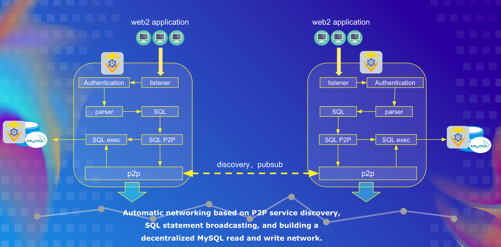

# IceFireDB-SQLProxy

IceFireDB-SQLProxy helps decentralize traditional SQL database data. Provide a convenient mechanism to build a globally distributed storage system with automatic networking. Commands are automatically synchronized between the SQL agents in the network, and the IceFireDB SQL agent writes data to MySQL storage.

Through the decentralized middleware network proxy, decentralized data synchronization can be enabled for MySQL databases commonly used in web2 applications.

## How does it work?



## Compile and install

```shell
cd IceFireDB-SQLProxy
make

IceFireDB-SQLProxy -h
```

## demo video

https://user-images.githubusercontent.com/21053373/173170210-df2d1539-acc1-4d93-8695-cc0ddc5d723b.mp4


## Application scenarios

- Building decentralized mysql storage
- Help traditional web2 applications access web3 architecture
