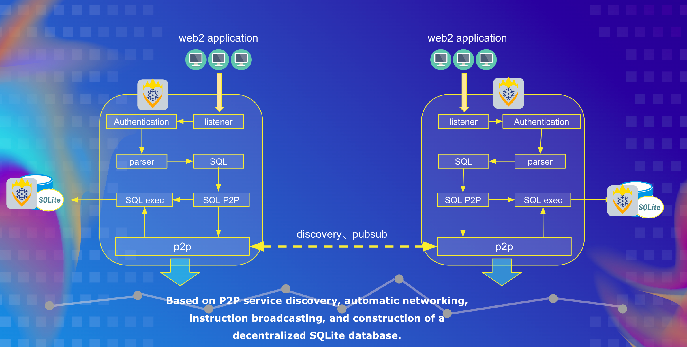

# IceFireDB-SQLite

IceFireDB SQLite database is a decentralized SQLite database. Provide a convenient mechanism to build a global distributed database system. Support users to write data to IceFireDB using MySQL protocol. IceFireDB stores the data in the SQLite database and synchronizes the data among the nodes in the P2P automatic networking.

## How does it work?


### Built With

* [Golang 1.17](https://go.dev/)

## Getting Started

#### Installation

1. Clone the repo

~~~bash
git clone https://github.com/IceFireDB/IceFireDB.git
~~~

2. Build

```shell
cd IceFireDB-SQLite
make
IceFireDB-SQLite -h
```


## Application scenarios

1. Build a decentralized SQLite database based on Mysql usage protocol

## Roadmap

- [x] P2P Support
- [x] Mysql-cli Client Support
- [x] Golang Gorm Support
- [ ] SQL Prepared Statements

### Demo video

https://user-images.githubusercontent.com/21053373/173170247-74b1daeb-7bd5-4dc0-8b93-62b334859ba8.mp4

