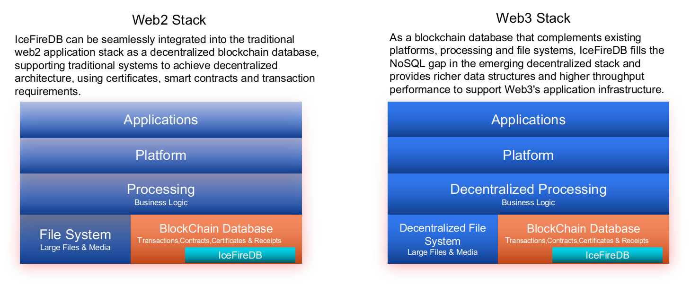
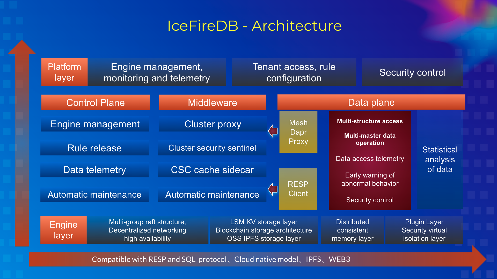

<!--
 * @Author: gitsrc
 * @Date: 2020-12-23 13:30:07
 * @LastEditors: gitsrc
 * @LastEditTime: 2022-05-07 09:10:45
 * @FilePath: /IceFireDB/README.md
-->

<p align="center">

</p>

# IceFireDB  - [ WEB2 + WEB3  ]


[](https://app.fossa.com/projects/git%2Bgithub.com%2FIceFireDB%2FIceFireDB?ref=badge_shield)


IceFireDB is a database built for web3 and web2. The core mission of the project is to help applications quickly achieve decentralization and data immutability. At present, the storage layer supports various storage methods such as disk, OSS, and IPFS. The protocol layer currently supports the RESP protocol, and will support the SQL and GraphQL protocols in the future. A blockchain fusion layer based on immutable transparent logs and Ethereum is under construction to support integration with higher-level decentralized computing platforms and applications as well as identity, financial assets, intellectual property and sidechain protocols. IceFireDB strives to fill the gap of the decentralized stack, making the data ecology of web3 applications more complete, and making it easier for web2 applications to achieve decentralization and data immutability.

<p align="center">

</p>

1. High performance
2. Distributed consistency
3. Reliable LSM disk storage
4. Support OSS storage engine
5. Based on IPFS decentralized storage, build a persistent data distributed storage layer.（beta version）
<<<<<<< HEAD
6. Build an immutable transparent log witness layer between web2 and web3, build a data hot and cold hybrid structure and an immutable data bridge layer. (inspired by google trillian-witness)(in progress)
7. Build a blockchain mechanism based on Ethereum and quorum.（In progress）
8. Support kv metadata layer and mixed storage structure of hot and cold. （web2 area support）
9. More advanced cache implementation, faster LSM persistent storage（Source of ideas: https://dl.acm.org/doi/10.1145/3448016.3452819 ）（Support the performance improvement of blockchain full-node）

# Project direction

IceFireDB originated from the distributed NoSQL database in the web2 scenario. We will continue to support the web2 distributed NoSQL database, while investing more energy in the direction of web3 and web2 decentralized databases. We are very grateful to our community partners for their continued interest, the community has been our driving force.
=======
6. Build a blockchain mechanism based on Ethereum and quorum.（Working hard）
7. Support kv metadata layer and mixed storage structure of hot and cold.
8. More advanced cache implementation, faster LSM persistent storage（Source of ideas: https://dl.acm.org/doi/10.1145/3448016.3452819 ）
9. The web2 environment supports a highly tamper-proof logging system in non-blockchain mode,For data manipulation, accuracy and integrity protection is provided.
<!-- 10.  DataMesh big data application architecture metadata support. -->
>>>>>>> a40c128e33a1ac6a7d7befea9aee2f9526745ad2

# Architecture

<p align="center">

</p>

# Command support
## 1. Strings
* APPEND
* BITCOUNT
* BITOP
* BITPOS
* DECR
* DECRBY
* DEL
* EXISTS
* GET
* GETBIT
* SETBIT
* GETRANGE
* GETSET
* INCR
* INCRBY
* MGET
* MSET
* SET
* SETEX
* SETEXAT
* SETRANGE
* EXPIRE
* EXPIREAT
* TTL
## 2. Hashes
* HSET
* HGET
* HDEL
* HEXISTS
* HGETALL
* HINCRBY
* HKEYS
* HLEN
* HMGET
* HMSET
* HSETEX
* HSTRLEN
* HVALS
* HCLEAR
* HMCLEAR
* HEXPIRE
* HEXPIREAT
* HKEYEXIST
* HTTL

## 3. Lists
* RPUSH
* LPOP
* LINDEX
* LPUSH
* RPOP
* LRANGE
* LSET
* LLEN
* RPOPLPUSH
* LCLEAR
* LMCLEAR
* LEXPIRE
* LEXPIREAT
* LKEYEXISTS
* LTRIM
* LTTL

## 4. Sorted Sets
* ZADD
* ZCARD
* ZCOUNT
* ZREM
* ZCLEAR
* ZRANK
* ZRANGE
* ZREVRANGE
* ZSCORE
* ZINCRBY
* ZREVRANK
* ZRANGEBYSCORE
* ZREVRANGEBYSCORE
* ZREMRANGEBYSCORE
* ZREMRANGEBYRANK

## 5. Sets
* SADD
* SCARD
* SDIFF
* SDIFFSTORE
* SINTER
* SINTERSTORE
* SISMEMBER
* SMEMBERS
* SREM
* SUNION
* SUNIONSTORE
* SCLEAR
* SMCLEAR
* SEXPIRE
* SEXPIREAT
* STTL
* SPERSIST
* SKEYEXISTS

## 6. System cmd
* INFO
* FLUSHALL
* HSCAN
* SSCAN
* ZSCAN
* XSCAN
* XHSCAN
* XSSCAN
* XZSCAN

# Performance
### 
```shell
corerman@ubuntu:~/DATA/ICODE/GoLang/IceFireDB$ redis-benchmark  -h 127.0.0.1 -p 11001 -n 10000000 -t set,get -c 512 -P 512 -q

SET: 253232.12 requests per second
GET: 2130875.50 requests per second
```

## License

[](https://app.fossa.com/projects/git%2Bgithub.com%2FIceFireDB%2FIceFireDB?ref=badge_large)

# Thanks 

### I stood on the shoulders of giants and did only simple things. Thank you for your attention.

* https://github.com/tidwall/uhaha
* https://github.com/syndtr/goleveldb
* https://github.com/dgraph-io/ristretto
* https://github.com/ledisdb/ledisdb
* https://github.com/dgraph-io/badger
* https://github.com/ipfs/ipfs

# Disclaimers
When you use this software, you have agreed and stated that the author, maintainer and contributor of this software are not responsible for any risks, costs or problems you encounter. If you find a software defect or BUG, ​​please submit a patch to help improve it!
