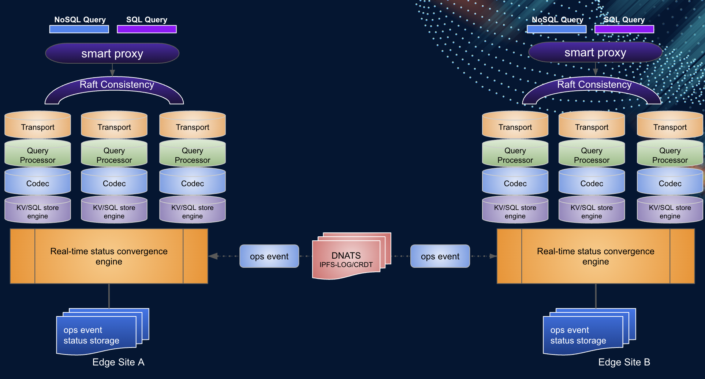
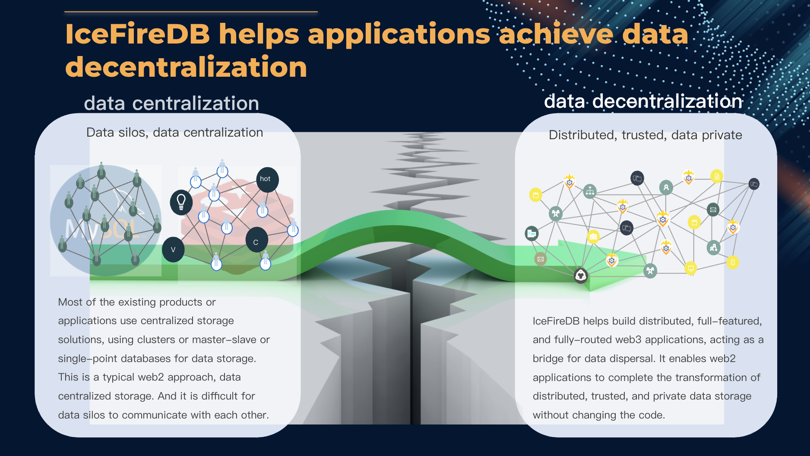
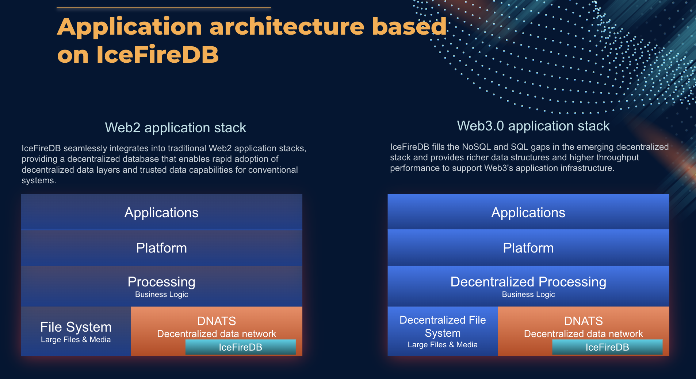
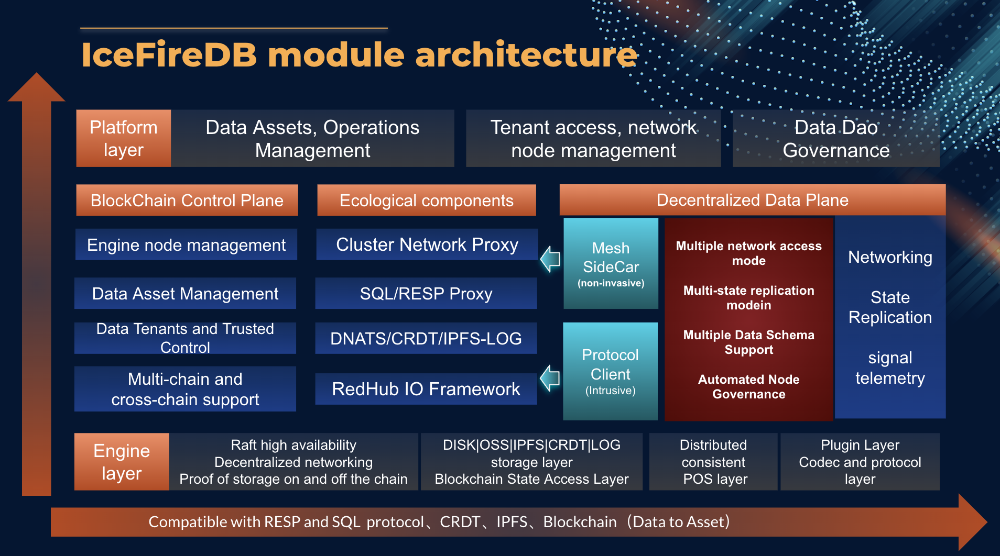

# 🚀 IceFireDB

### **Decentralized Database Infrastructure for Web2 & Web3**

*A high-performance, decentralized database engine bridging Web2 and Web3 ecosystems with advanced distributed consensus and storage capabilities.*

---

## 📖 Table of Contents

- [🌟 Overview](#-overview)
- [✨ Key Features](#-key-features)
- [🏗️ Architecture](#️-architecture)
- [📚 Documentation](#-documentation)
- [🔧 Project Components](#-project-components)
  - [IceFireDB-SQLite](#icefiredb-sqlite)
  - [IceFireDB-SQLProxy](#icefiredb-sqlproxy)
  - [IceFireDB-Redis-Proxy](#icefiredb-redis-proxy)
  - [IceFireDB-PubSub](#icefiredb-pubsub)
  - [IceFireDB-NoSQL](#icefiredb-nosql)
- [⚙️ System Design](#️-system-design)
- [🚀 Quick Start](#-quick-start)
- [📋 Command Support](#-command-support)
- [🎯 Roadmap](#-roadmap)
- [📄 License](#-license)

## 🌟 Overview

IceFireDB is an advanced decentralized database infrastructure that bridges traditional Web2 applications with the emerging Web3 ecosystem. Built on cutting-edge distributed systems research, it provides a robust foundation for building decentralized applications with enterprise-grade performance and reliability.

### Core Innovations

- **Hybrid Consensus**: Combines Raft for intra-site consistency with P2P CRDT for cross-site synchronization
- **Multi-Storage Support**: Seamlessly integrates disk storage, OSS, and IPFS for flexible data persistence
- **Protocol Compatibility**: Supports both SQL (MySQL protocol) and NoSQL (Redis RESP protocol) interfaces
- **Decentralized Networking**: Enables automatic P2P networking for distributed data synchronization

## ✨ Key Features

| Feature | Status | Description |
|---------|--------|-------------|
| 🚀 High Performance | 🔄 Ongoing Optimization | Optimized for low-latency, high-throughput operations |
| 💾 Multi-Storage Support | ✅ Implemented | LSM disk, OSS, IPFS, and hybrid storage drivers |
| 🔄 Distributed Consistency | ✅ Implemented | Raft, P2P-CRDT, and IPFS-LOG consensus modes |
| 🌐 IPFS Integration | 🧪 Beta | Persistent decentralized storage layer |
| 🤖 P2P Auto-Networking | 🧪 Beta | Automatic decentralized network formation |
| 🔑 KV Storage Engine | 🧪 Beta | CRDT-based and IPFS-LOG based KV stores |
| 🧠 AI Vector Database | 🔄 In Progress | Vector storage and similarity search capabilities |
| 📡 NATS Integration | 🔄 In Progress | High-performance decentralized messaging |
| 📝 Tamper-Resistant Logs | 📋 Planned | Auditable, scalable logging with QED integration |
| 🌉 Web2-Web3 Bridge | 📋 Planned | Immutable data witness layer |
| 🔄 Hot/Cold Storage | ✅ Implemented | Tiered storage via `hybriddb` driver |

## 🏗️ Architecture

  

### Decentralized Database Engine

  

IceFireDB is designed as a bridge between Web2 and Web3 worlds, enabling:
- **Web2 Migration**: Traditional applications can gradually adopt decentralization
- **Web3 Native**: Built-in support for decentralized storage and consensus
- **Data Immutability**: Ensures data integrity and auditability
- **Protocol Flexibility**: Supports both SQL and NoSQL interfaces

  

## 📚 Documentation

  

### 📖 Comprehensive Documentation

Visit our official documentation center for detailed guides, API references, and architectural deep dives:

🔗 **[Documentation Center](https://docs.icefiredb.xyz/icefiredb_docs/)** - https://docs.icefiredb.xyz/icefiredb_docs/

Our documentation includes:
- 🚀 Quick start guides
- 🏗️ Architecture overviews
- 🔧 Installation and configuration
- 📚 API references
- 🎯 Best practices
- 🔍 Troubleshooting guides

## 🔧 Project Components

IceFireDB is composed of several specialized components that work together to provide comprehensive decentralized database capabilities:

### 🗄️ [IceFireDB-SQLite](https://github.com/IceFireDB/IceFireDB/tree/main/IceFireDB-SQLite)

A decentralized SQLite database that enables global distributed SQL operations:
- **MySQL Protocol Support**: Write data using standard MySQL protocol
- **P2P Synchronization**: Automatic data synchronization across nodes
- **SQLite Backend**: Leverages SQLite for local data persistence
- **Global Distribution**: Build global distributed database systems

### 🔄 [IceFireDB-SQLProxy](https://github.com/IceFireDB/IceFireDB/tree/main/IceFireDB-SQLProxy)

Decentralized SQL database networking system for traditional Web2 databases:
- **Web2 Migration**: Enables gradual decentralization of existing MySQL databases
- **Command Synchronization**: Automatic command replication across network nodes
- **MySQL Integration**: Seamless integration with existing MySQL infrastructure
- **Global Storage**: Build globally distributed storage with automatic networking

### 🔴 [IceFireDB-Redis-Proxy](https://github.com/IceFireDB/IceFireDB/tree/main/IceFireDB-Redis-Proxy)

Adds decentralization capabilities to traditional Redis databases:
- **Redis Protocol**: Full Redis RESP protocol compatibility
- **Decentralized Middleware**: Network proxy for Redis decentralization
- **Cluster Support**: Works with Redis clusters and single instances
- **Data Synchronization**: Automatic instruction synchronization across nodes

### 📡 [IceFireDB-PubSub](https://github.com/IceFireDB/IceFireDB/tree/main/IceFireDB-PubSub)

High-performance decentralized publish-subscribe system:
- **Redis PubSub Compatibility**: Seamless migration from Redis pub/sub
- **High Availability**: Built-in redundancy and failover mechanisms
- **P2P Networking**: Decentralized peer-to-peer subscription network
- **Web2 Migration**: Easy transition for existing Redis pub/sub applications

### 🗃️ [IceFireDB-NoSQL](https://github.com/IceFireDB/IceFireDB)

Core NoSQL database engine with multiple operational modes:
- **Web2 Mode**: Distributed Raft-based disk Redis database
- **Web3 Mode**: Decentralized IPFS storage mode
- **Hybrid Operation**: Support for both traditional and decentralized storage
- **Protocol Support**: Full Redis RESP protocol implementation

## 📋 Command Support

IceFireDB provides comprehensive Redis-compatible command support across all major data types:

### 📝 Strings
- **Basic Operations**: SET, GET, DEL, EXISTS, INCR, DECR, APPEND
- **Bit Operations**: SETBIT, GETBIT, BITCOUNT, BITOP, BITPOS
- **Range Operations**: GETRANGE, SETRANGE, GETSET
- **Expiration**: SETEX, SETEXAT, EXPIRE, EXPIREAT, TTL
- **Batch Operations**: MGET, MSET

### 🗂️ Hashes
- **Field Operations**: HSET, HGET, HDEL, HEXISTS, HGETALL
- **Incremental**: HINCRBY
- **Key Management**: HKEYS, HVALS, HLEN, HSTRLEN
- **Batch Operations**: HMSET, HMGET
- **Expiration**: HEXPIRE, HEXPIREAT, HTTL, HKEYEXIST
- **Management**: HCLEAR, HMCLEAR, HSETEX

### 📋 Lists
- **Push/Pop**: LPUSH, RPUSH, LPOP, RPOP, RPOPLPUSH
- **Access**: LINDEX, LRANGE, LSET, LLEN
- **Management**: LTRIM, LCLEAR, LMCLEAR
- **Expiration**: LEXPIRE, LEXPIREAT, LTTL, LKEYEXISTS

### 🔢 Sets
- **Membership**: SADD, SREM, SISMEMBER, SMEMBERS
- **Operations**: SINTER, SUNION, SDIFF
- **Store Operations**: SINTERSTORE, SUNIONSTORE, SDIFFSTORE
- **Management**: SCARD, SCLEAR, SMCLEAR
- **Expiration**: SEXPIRE, SEXPIREAT, STTL, SPERSIST, SKEYEXISTS

### 📊 Sorted Sets
- **Score Operations**: ZADD, ZSCORE, ZINCRBY
- **Range Operations**: ZRANGE, ZREVRANGE, ZRANGEBYSCORE, ZREVRANGEBYSCORE
- **Rank Operations**: ZRANK, ZREVRANK
- **Management**: ZCARD, ZCOUNT, ZREM, ZCLEAR
- **Range Removal**: ZREMRANGEBYSCORE, ZREMRANGEBYRANK

## ⚙️ System Design

IceFireDB implements a sophisticated layered architecture with the following core components:

| Component | Description | Technologies |
|-----------|-------------|--------------|
| **🌐 [Network Layer](https://docs.icefiredb.xyz/icefiredb_docs/icefiredb/icefiredb-nosql/designs/network/)** | Multi-protocol networking with hybrid consensus | **P2P**, **RAFT**, **NATS** |
| **💾 [Storage Layer](https://docs.icefiredb.xyz/icefiredb_docs/icefiredb/icefiredb-nosql/designs/storage/)** | Multi-engine storage abstraction with Web2/Web3 compatibility | **goleveldb**, **badger**, **hybriddb**, **IPFS**, **CRDT**, **IPFS-LOG**, **IPFS-SYNCKV**, **OSS** |
| **📡 [Protocol Layer](https://docs.icefiredb.xyz/icefiredb_docs/icefiredb/icefiredb-nosql/designs/protocol/)** | Multi-protocol support for broad application compatibility | **RESP**, **SQL** |
| **🔧 [Codec Layer](https://docs.icefiredb.xyz/icefiredb_docs/icefiredb/icefiredb-nosql/designs/codec/)** | Core data abstraction and encoding/decoding engine | **KV**, **Strings**, **Hashes**, **Lists**, **Sorted Sets**, **Sets**, **SQL**, **PubSub** |

## 🧱 Backend Support Matrix (1.0.0)

Storage backends are classified by support tier for the 1.0.0 release. "GA" backends are
recommended for production; "Beta" are usable and CI-tested but may need tuning or carry
caveats; "Experimental" are decentralized/external-service backends still maturing.

| Backend       | Tier         | Storage              | External dependency      | Notes |
|---------------|--------------|----------------------|--------------------------|-------|
| `goleveldb`   | **GA**       | Local LSM (default)  | none                     | Default engine; mature ledis storage. |
| `hybriddb`    | **GA**       | Local hot/cold tier  | none                     | ristretto cache over leveldb; has dedicated unit tests. |
| `badger`      | **GA**       | Local LSM            | none                     | GA-graduated: snapshot isolation + Compact GC; passes crash-recovery, failover, rolling-restart, leader-churn, soak, and RESP-compat. Default open options are memory-heavy — tune before heavy production use. |
| `ipfs-synckv` | Beta         | IPFS + local mirror  | IPFS daemon (:5001)      | Encrypted (AES-GCM); CI-tested against a real IPFS node. |
| `ipfs`        | Experimental | IPFS                 | IPFS daemon (:5001)      | Decentralized storage; beta maturity. |
| `ipfs-log`    | Experimental | IPFS append-only log | IPFS daemon (:5001)      | Decentralized log; multi-node identifier via `--ipfs-log-dbname`. |
| `oss`         | Experimental | S3 / object storage  | S3 endpoint + credentials| Object-storage backend. |
| `crdt`        | Experimental | P2P CRDT             | libp2p networking        | Conflict-free cross-site sync; beta maturity. |

> All backends are exercised by the per-backend CI jobs in `.github/workflows/test.yml`.
> Tier reflects production-readiness and operational complexity, not just test coverage.
> RESP semantics are identical across backends — see [COMPATIBILITY.md](COMPATIBILITY.md).

## 💾 Durability & `--nosync`

Writes go through the Raft log before being applied to the storage backend. By
default each Raft log append is synced to disk (`fsync`) before the write is
acknowledged, so an acknowledged write survives a power loss or process crash on
that node.

- **Default (sync on):** durable but slower — every write pays an `fsync`.
- **`--nosync`:** the Raft log is *not* fsync'd on every append. Writes are much
  faster, but a sudden power loss or OS crash can lose the most recent
  acknowledged writes on that node. A clean process kill (e.g. `SIGKILL`) is
  still safe because the data already reached the OS page cache; `--nosync` only
  trades away protection against losing un-flushed pages on power/kernel failure.

In a multi-node cluster, a Raft write commits once a **majority** of nodes have
appended it, so the cluster as a whole tolerates the loss of a minority of nodes
even with `--nosync`. Crash-recovery and leader-failover behavior is verified by
the integration tests (`make test-integration`).

Recommendation: keep the default (sync on) for single-node or durability-
sensitive deployments; consider `--nosync` only for multi-node clusters where the
majority-commit guarantee and higher throughput outweigh per-node power-loss risk.

## 🚀 Quick Start

Get started with IceFireDB in minutes with our comprehensive quick start guide:

🔗 **[Quick Start Guide](https://docs.icefiredb.xyz/icefiredb_docs/icefiredb/icefiredb-nosql/quick_start/)**

## 🎯 Roadmap

IceFireDB originated as a distributed NoSQL database for Web2 scenarios and continues to evolve:

- **Web2 Support**: Ongoing support for traditional distributed NoSQL databases
- **Web3 Expansion**: Increased focus on decentralized database technologies
- **Hybrid Approach**: Bridging Web2 and Web3 ecosystems with seamless migration paths
- **Community Driven**: Development guided by community needs and contributions

We're grateful for our community partners and contributors who continue to drive innovation forward.

## 📄 License

IceFireDB is released under the Apache License 2.0:

### 📝 Legal Disclaimer

**Important**: By using this software, you acknowledge and agree that:

- The authors, maintainers, and contributors of IceFireDB are not liable for any risks, costs, or problems you may encounter
- This is open-source software provided "as-is" without warranties of any kind
- If you discover software defects or bugs, we encourage you to submit patches to help improve the project
- Users are responsible for evaluating the software's suitability for their specific use cases

---

**Built with ❤️ by the IceFireLabs**

[📚 Documentation](https://docs.icefiredb.xyz/icefiredb_docs/) • 
[🐛 Report Issues](https://github.com/IceFireDB/IceFireDB/issues) • 

