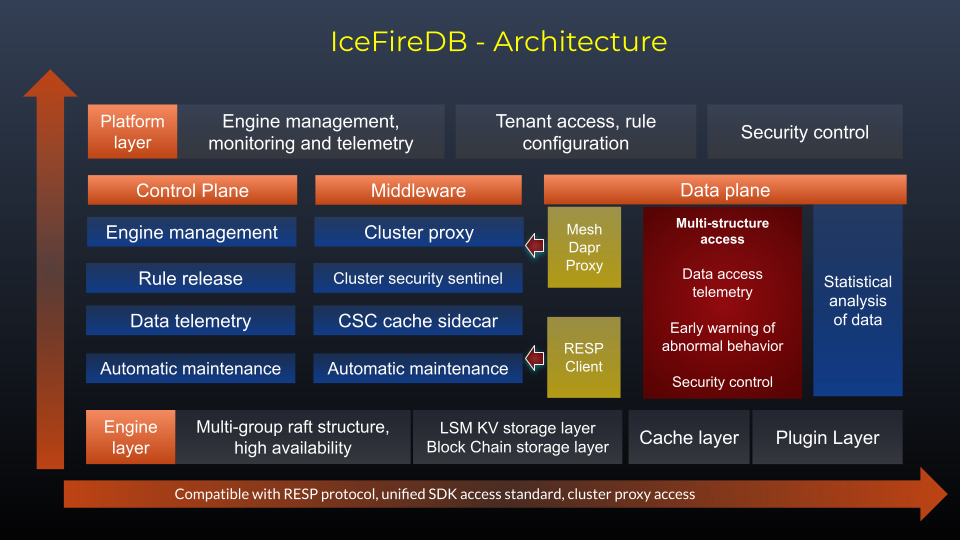

<!--
 * @Author: gitsrc
 * @Date: 2020-12-23 13:30:07
 * @LastEditors: gitsrc
 * @LastEditTime: 2022-02-11 10:39:33
 * @FilePath: /IceFireDB/README.md
-->

<p align="center">

</p>

# IceFireDB  - [ WEB2 + WEB3  ]


[](https://app.fossa.com/projects/git%2Bgithub.com%2FIceFireDB%2FIceFireDB?ref=badge_shield)


Cloud native decentralized distributed nosql database, Web3 world access point, based on RESP,RAFT,OSS,IPFS and blockchain.

1. High performance
2. Distributed consistency
3. Reliable LSM disk storage
4. Support OSS storage engine
5. Based on IPFS decentralized storage, build a persistent data distributed storage layer.（beta version）
6. Support kv metadata layer and mixed storage structure of hot and cold（upgrading soon）
7. More advanced cache implementation, faster LSM persistent storage（Source of ideas: https://dl.acm.org/doi/10.1145/3448016.3452819）

# Architecture

<p align="center">

</p>

# Command support
## 1. Strings
* APPEND
* BITCOUNT
* BITOP
* BITPOS
* DECR
* DECRBY
* DEL
* EXISTS
* GET
* GETBIT
* SETBIT
* GETRANGE
* GETSET
* INCR
* INCRBY
* MGET
* MSET
* SET
* SETEX
* SETEXAT
* SETRANGE
* EXPIRE
* EXPIREAT
* TTL
## 2. Hashes
* HSET
* HGET
* HDEL
* HEXISTS
* HGETALL
* HINCRBY
* HKEYS
* HLEN
* HMGET
* HMSET
* HSETEX
* HSTRLEN
* HVALS
* HCLEAR
* HMCLEAR
* HEXPIRE
* HEXPIREAT
* HKEYEXIST
* HTTL

## 3. Lists
* RPUSH
* LPOP
* LINDEX
* LPUSH
* RPOP
* LRANGE
* LSET
* LLEN
* RPOPLPUSH
* LCLEAR
* LMCLEAR
* LEXPIRE
* LEXPIREAT
* LKEYEXISTS
* LTRIM
* LTTL

## 4. Sorted Sets
* ZADD
* ZCARD
* ZCOUNT
* ZREM
* ZCLEAR
* ZRANK
* ZRANGE
* ZREVRANGE
* ZSCORE
* ZINCRBY
* ZREVRANK
* ZRANGEBYSCORE
* ZREVRANGEBYSCORE
* ZREMRANGEBYSCORE
* ZREMRANGEBYRANK

## 5. Sets
* SADD
* SCARD
* SDIFF
* SDIFFSTORE
* SINTER
* SINTERSTORE
* SISMEMBER
* SMEMBERS
* SREM
* SUNION
* SUNIONSTORE
* SCLEAR
* SMCLEAR
* SEXPIRE
* SEXPIREAT
* STTL
* SPERSIST
* SKEYEXISTS

## 6. System cmd
* INFO
* FLUSHALL
* HSCAN
* SSCAN
* ZSCAN
* XSCAN
* XHSCAN
* XSSCAN
* XZSCAN

# Performance
### 
```shell
corerman@ubuntu:~/DATA/ICODE/GoLang/IceFireDB$ redis-benchmark  -h 127.0.0.1 -p 11001 -n 10000000 -t set,get -c 512 -P 512 -q

SET: 253232.12 requests per second
GET: 2130875.50 requests per second
```

## License

[](https://app.fossa.com/projects/git%2Bgithub.com%2FIceFireDB%2FIceFireDB?ref=badge_large)

# Thanks 

### I stood on the shoulders of giants and did only simple things. Thank you for your attention.

* https://github.com/tidwall/uhaha
* https://github.com/syndtr/goleveldb
* https://github.com/dgraph-io/ristretto
* https://github.com/ledisdb/ledisdb
* https://github.com/dgraph-io/badger
* https://github.com/ipfs/ipfs

# Disclaimers
When you use this software, you have agreed and stated that the author, maintainer and contributor of this software are not responsible for any risks, costs or problems you encounter. If you find a software defect or BUG, ​​please submit a patch to help improve it!
